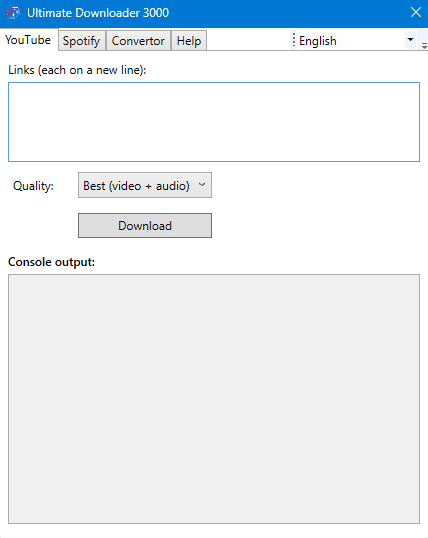

# 🎬 UltimateDownloader3000

**UltimateDownloader3000** is a WPF application for Windows that lets you easily download and convert multimedia content from various platforms like YouTube and Spotify using tools like `yt-dlp`, `spotDL`, and `ffmpeg`.

 <!-- Replace with your own screenshot if needed -->

## 🚀 Features

- ✅ Support for downloading videos from **YouTube** via `yt-dlp`
- ✅ Download music from **Spotify** using `spotDL`
- ✅ Fast and efficient **file conversion** via `ffmpeg`
- ✅ Ability to **input multiple links at once**
- ✅ Option to select **quality and format**
- ✅ Clean and modern **graphical interface (WPF)**
- ✅ Choose **output folder**
- ✅ Real-time **console output display** in the GUI

## 📦 Dependencies

The app uses the following tools:

- [`yt-dlp`](https://github.com/yt-dlp/yt-dlp)
- [`ffmpeg`](https://ffmpeg.org/)
- [`spotDL`](https://github.com/spotDL/spotify-downloader)
- .NET 8 (required to run the WPF app)

## 🔧 Installation

1. **Install the dependencies**:

   - Download and add to your PATH (this is really necessary step, use some yt tutorial for help)
     - [yt-dlp](https://github.com/yt-dlp/yt-dlp/releases)
     - [ffmpeg](https://ffmpeg.org/download.html)
     - [spotDL](https://github.com/spotDL/spotify-downloader)

2. **Download the latest release**.
3. **Extract the files anywhere (e.g., your desktop)**.
4. **Run UltimateDownloader3000.exe** and start downloading!

## 🧠 How to Use

1. Select the download type: **YouTube**, **Spotify**, or **Conversion**.
2. Paste one or more links **(one per line)**.
3. Set the output folder and desired quality/format.
4. Click **Download** and watch the console output in real-time.
5. Done! ✅

## 🛠️ In Progress

- [ ] Download history
- [ ] (Better) completion notifications
- [ ] Multi-language support
- [ ] Progress bar

## 💡 Tips

- For `spotDL` to work properly, you need to have Python installed and set up Spotify API access (the tool will guide you on first use).
- If something doesn’t work, check the console output at the bottom of the app — it might show an error message.

## 🧑‍💻 Author

Built with C# and WPF.  
If you have suggestions or found a bug, feel free to open an issue or a pull request.

---

Yeah, this whole readme was generated by ChatGPT, don’t yell at me, I'm not Shakespeare.
